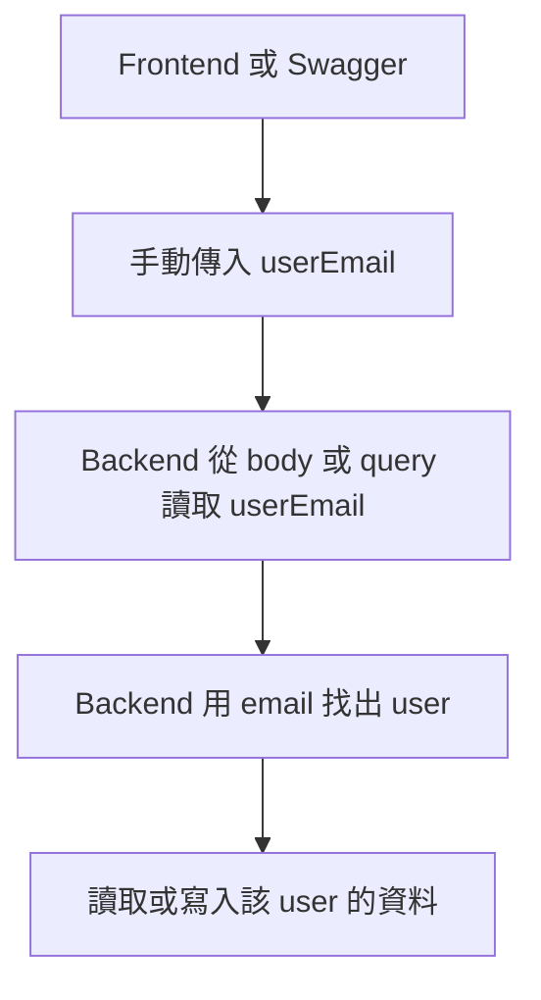
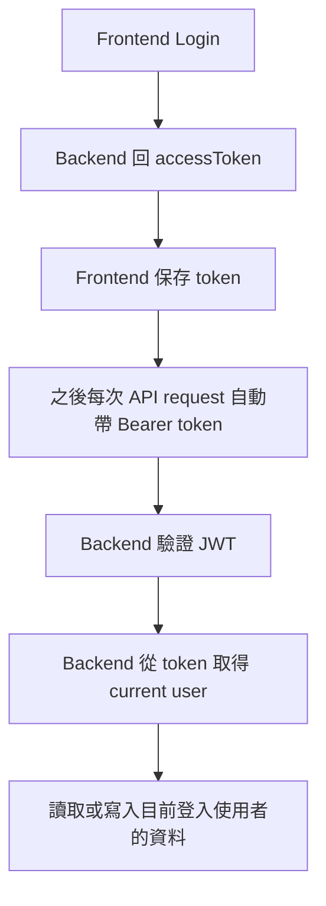
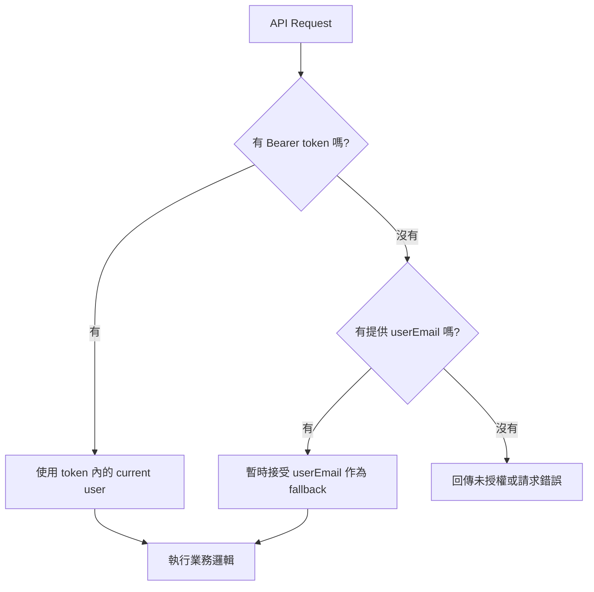
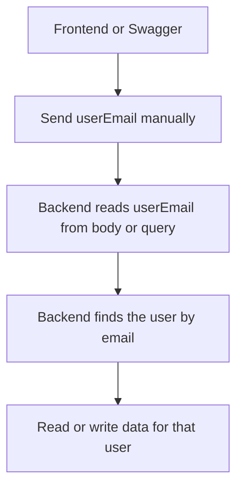
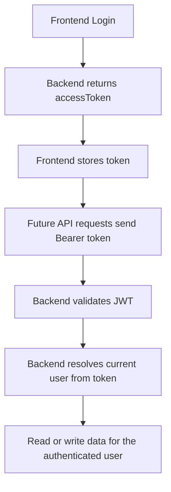
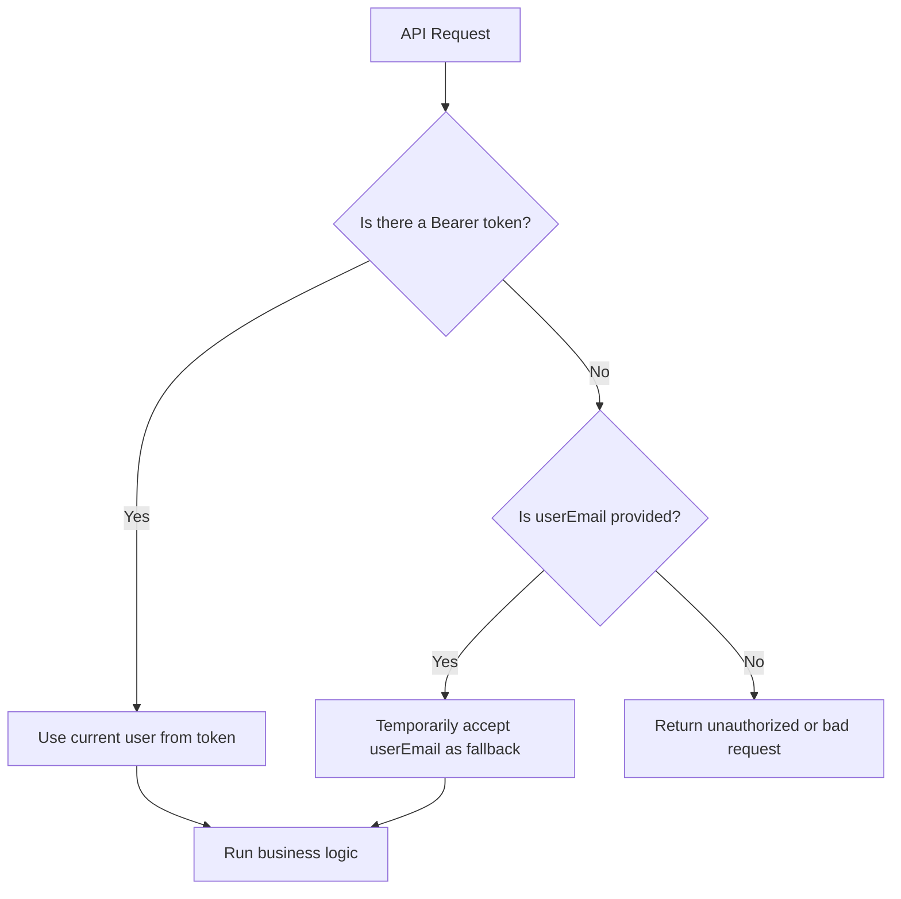

# CashFlow Auth Transition

## 中文

### 目前在做什麼

CashFlow 正在從「手動傳 `userEmail`」過渡到「登入後用 JWT token 辨識使用者」。

目前系統處於過渡期：

- 有登入 token 時：後端優先使用 token 內的使用者身份
- 沒有 token 時：部分 API 暫時仍接受 `userEmail`

這樣做的目的是在不一次打壞既有流程的前提下，慢慢把系統移到較安全、較正常的身份模型。

### 舊模式：手動傳 `userEmail`

在舊模式中，前端或 Swagger 會直接在 request body 或 query string 傳入 `userEmail`。

範例：

```http
GET /api/v1/transactions?userEmail=demo@cashflow.local
```

```json
{
  "userEmail": "demo@cashflow.local",
  "type": "expense",
  "amount": 120,
  "occurredOn": "2026-04-06",
  "note": "Lunch"
}
```

流程如下：



這種做法的問題：

- 使用者可以手動改成別人的 email
- 後端需要相信外部傳入的身份資訊
- 做登入系統後會很難維護
- controller 和 service 都會一直帶著 `userEmail` 參數

### 新模式：JWT token 身份模型

新模式的做法是：

1. 使用者先註冊或登入
2. 後端回傳 `accessToken`
3. 前端之後每次 request 自動帶上 token
4. 後端驗證 token
5. 後端從 token 取得目前登入使用者
6. 依該使用者身份讀寫資料

範例：

登入：

```http
POST /api/v1/auth/login
```

```json
{
  "email": "demo-auth@cashflow.local",
  "password": "StrongPassword123"
}
```

登入成功後，後端回傳：

```json
{
  "accessToken": "..."
}
```

之後新增交易：

```http
POST /api/v1/transactions
Authorization: Bearer <accessToken>
```

```json
{
  "type": "expense",
  "amount": 120,
  "occurredOn": "2026-04-06",
  "note": "Lunch"
}
```

此時 request body 不需要再傳 `userEmail`。

流程如下：



### 目前過渡中的實際流程

CashFlow 現在不是完全舊模式，也不是完全新模式，而是過渡設計：



這代表：

- 新前端流程已經可以靠登入 token 工作
- 舊的 Swagger 或測試流程暫時仍能靠 `userEmail`
- 長期目標是完全移除 `userEmail` fallback

### 為什麼這樣比較好

使用 JWT token 取代手傳 `userEmail` 有幾個好處：

- 較安全：使用者不能直接冒充別人的 email
- 較一致：身份來源統一由 auth 管理
- 較容易維護：controller 和 service 不用一直傳 `userEmail`
- 較像正式產品：前端和 app 都會走登入態模型

### 下一步

Auth 過渡完成前，最重要的後續工作是：

1. 前端 API 全面改成 token 優先
2. 前端逐步移除手動輸入 `userEmail`
3. 後端逐步拔掉 `userEmail` fallback
4. 長期只保留 authenticated user context

---

## English

### What Is Happening Now

CashFlow is moving from a manual `userEmail` request model to a JWT-based authenticated user model.

The system is currently in a transition phase:

- If a Bearer token is present, the backend prefers the authenticated user from the token
- If no token is present, some APIs still temporarily accept `userEmail`

This lets the project move toward a safer and cleaner auth design without breaking the current MVP flow all at once.

### Old Model: Manually Passing `userEmail`

In the old model, the frontend or Swagger sends `userEmail` directly in the query string or request body.

Example:

```http
GET /api/v1/transactions?userEmail=demo@cashflow.local
```

```json
{
  "userEmail": "demo@cashflow.local",
  "type": "expense",
  "amount": 120,
  "occurredOn": "2026-04-06",
  "note": "Lunch"
}
```

Flow:



Problems with this approach:

- A caller can manually change the email
- The backend must trust caller-supplied identity data
- It becomes awkward once real login is introduced
- `userEmail` leaks into many controller and service signatures

### New Model: JWT-Based Identity

In the new model:

1. The user registers or logs in
2. The backend returns an `accessToken`
3. The frontend sends that token with future requests
4. The backend validates the token
5. The backend resolves the current user from the token
6. Data is read or written for that authenticated user

Example:

Login:

```http
POST /api/v1/auth/login
```

```json
{
  "email": "demo-auth@cashflow.local",
  "password": "StrongPassword123"
}
```

Successful login returns:

```json
{
  "accessToken": "..."
}
```

Then create a transaction:

```http
POST /api/v1/transactions
Authorization: Bearer <accessToken>
```

```json
{
  "type": "expense",
  "amount": 120,
  "occurredOn": "2026-04-06",
  "note": "Lunch"
}
```

No `userEmail` is needed in the request body anymore.

Flow:



### Current Transition Design

CashFlow is currently in a hybrid transition state:



This means:

- The new frontend flow can already work through JWT auth
- Older Swagger/manual testing flows can still use `userEmail`
- The long-term goal is to fully remove the `userEmail` fallback

### Why This Is Better

Using JWT-based identity instead of manually passing `userEmail` brings several benefits:

- Safer: callers cannot easily pretend to be another user
- Cleaner: auth becomes the single identity source
- Easier to maintain: controllers and services stop passing `userEmail` around
- More production-like: frontend and app flows match real-world login patterns

### Next Steps

The most important follow-up steps are:

1. Make frontend API usage fully token-first
2. Gradually remove manual `userEmail` input from the UI
3. Remove `userEmail` fallback from backend endpoints
4. Keep authenticated user context as the only long-term identity model
