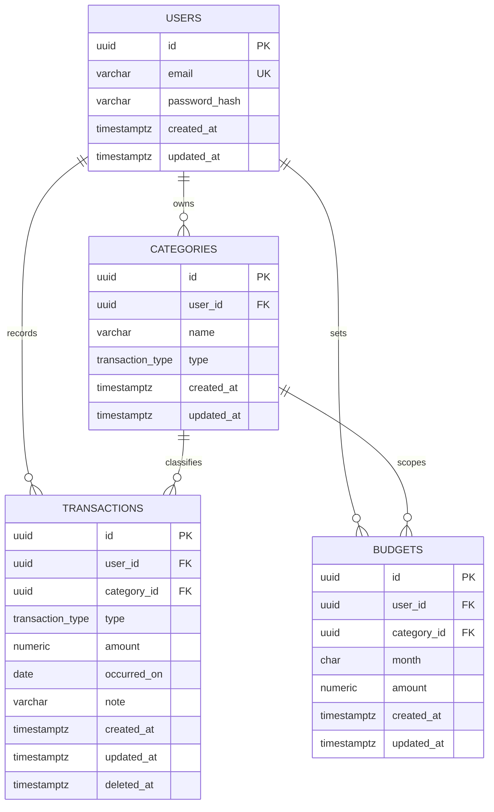

# CashFlow ERD

This document describes the current PostgreSQL schema defined in `db/migrations/0001_init.sql`.

## Mermaid ERD

## Relationship Notes

- `users` is the root entity for all business data.
- `categories` belongs to a user and is unique by `(user_id, name, type)`.
- `transactions` belongs to a user and may optionally reference a category.
- `budgets` belongs to a user and may optionally reference a category.
- `transactions.deleted_at` is used for soft delete.
- `budgets.category_id = NULL` represents a whole-month budget instead of a category-specific budget.

## UI Mapping

- Dashboard / overview:
  - `transactions`
  - `budgets`
- Transactions page:
  - `transactions`
  - `categories`
- Categories page:
  - `categories`
- Budgets page:
  - `budgets`
  - `categories`
